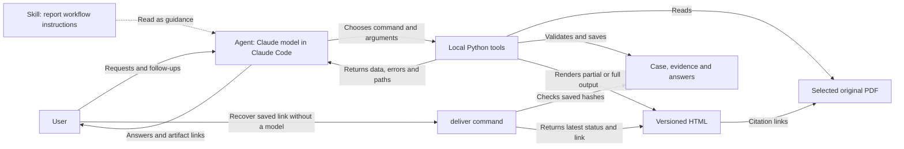
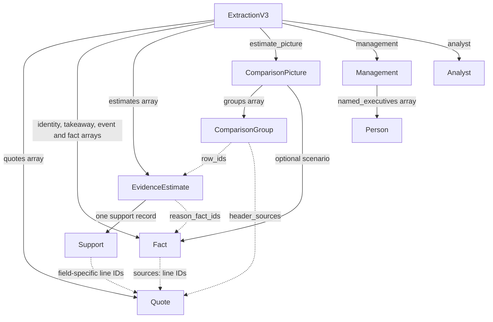

# Walk through the current code

Read the [README](../README.md) first. This is the current code walkthrough;
[deliverables](deliverables.md) maps requirements and [iterations](../submission/evaluation.md)
keeps historical decisions and results. You do not need the history to understand
this application.

## The whole path

**There is an agent: Claude running inside Claude Code.** The model chooses an
action, Claude Code executes its tool call, and the returned data or error informs
the next action. The skill is text that this agent reads, not an executable actor
or a replacement for the agent. Claude also uses native Read/Write to inspect
returned file paths and create candidate JSON. Python commands do not call Claude.

For example, "explain the second change" leads the agent to read case context,
locate that claim's original lines, and save a short answer. "Show only FY26" can
use `render` without re-extraction. A validation error returns to the agent for a
bounded correction. Python implements each operation; it does not choose the
conversation's next research question.

| Component | Responsibility | What this repository supplies |
| --- | --- | --- |
| Claude model + Claude Code | Reasoning, tool loop, conversation, permissions and resume | We select/configure this existing runtime; we did not implement it |
| Native skill | Task instructions, source-use rules and review procedure | A workflow specialization read by the agent; instructions are not a hard security boundary |
| Python tools | Lookup, data validation, calculation, saved state and rendering | Explicit functions with JSON inputs/outputs and local artifacts |
| HTML and PDF viewer | Read the brief and inspect original evidence | Presentation and source access; neither runs an agent |

This division follows Claude Code's documented [agent loop](https://code.claude.com/docs/en/how-claude-code-works)
and [skill mechanism](https://code.claude.com/docs/en/skills). The project demonstrates
domain tools, evidence contracts and workflow design; it does not claim a custom
agent runtime. The older web/batch harness remains a separate one-shot baseline.

## Design choices and their limits

The code is mainly ordinary functions operating on data. `Claim`, `Estimate`,
`ExtractionV3` and `Answer` are Pydantic data contracts: they describe fields and
validate incoming JSON. They are not a hierarchy of active analyst, broker or
agent objects. `StrictModel` shares validation settings; `ExtractionV3` retains
compatibility with earlier saved evidence. This uses classes for schemas without
adopting a service/repository/factory architecture.

Schema classes are useful here because model output can omit fields, mix types
or invent extra fields. Plain unvalidated dictionaries would lose that check;
handwritten dictionary validation would duplicate what Pydantic already provides.
Other internal records remain dictionaries. There is no need to convert them into
classes unless an actual boundary needs validation. Function-first code can still
be overengineered or overfit; avoiding object-oriented patterns is not sufficient.

| Choice | Reason for keeping it | Assumption or cost to revisit |
| --- | --- | --- |
| Explicit source references and separate evidence/output | Required traceability; composition can shorten prose without losing evidence | Exact locations cannot prove interpretation or completeness |
| Domain-specific estimates with periods, units and prior/stated values | The brief asks for estimate changes and consensus comparisons | This is a sell-side briefing contract, not a general annual-report ontology; results vs forecasts still rely on model classification and notes |
| Case files and version directories | Resume, source identity and comparison of revisions | Deliberately local; no database, multi-user workflow or distributed locking |
| Agent instructions plus deterministic tools | Reuse an existing conversational runtime while checking operations in code | Skill adherence is model behavior; the interactive host retains general file tools |
| One source-backed self-review before handoff | Address semantic mistakes missed by structural validation | Same-agent errors can be correlated; it is not an independent verifier |
| Approximate 220-word target; 45-word fact cap | Prefer concise optional prose while retaining every required fact | 220 is now advisory in native and baseline composition; overflow does not reject publication or require a model retry. The separate per-fact cap remains a constraint to reassess. |
| No fixed item-count cap on material evidence | A sourced follow-up can add facts without an unrelated count failure; composition controls final prose length | Required facts may exceed the target; optional facts can stay in evidence without appearing in the brief |
| Conservative cover matching, including a narrow GY/GR alias | Avoid silently selecting another issuer's report | Small observed coverage does not justify a universal ticker resolver |

The overfitting risk is primarily in the output schema, lookup rules and prompts
adapted after a handful of examples. The quote/arithmetic/version checks express
general invariants; company-specific expected answers must stay out of them. Keep
metric names and periods open, represent missing values explicitly, and do not
force a source into a familiar prior/new pattern when the report does not support it.
Prompt changes after a failure are development improvements, not evidence of
generalization. Evaluate on untouched documents only under a new bounded test plan.

The six-material-fact cap caused an avoidable amendment failure: appending sourced
clauses failed schema validation before composition could check whether they fit.
That cap has now been removed, rather than raised to another arbitrary number.
Evidence validity and output length are separate concerns. Exact quotations,
required-fact retention, arithmetic and version checks still apply. Other list
caps and the 45-word clause cap remain; this is a targeted simplification, not a
claim that every editorial restriction has been removed.

The subsequent [ten-report evaluation](../submission/evaluation.md)
exposed target-label and rounded basis-point revision defects. The current tools
accept supported target-price synonyms and horizons such as `12-mth`/`12-month`.
`reported_revision_bps` now preserves a printed basis-point revision separately
from a relative percentage or a calculated difference between rounded levels.
Equal old/new levels can therefore remain a real reported revision. Names still
need original evidence; executive role descriptions can be supported paraphrases
rather than exact substring copies. Semantic accuracy still needs source review.

[Offline preserved-input regressions](../submission/evaluation.md)
reproduce the old Ahold and Jahez failures without another model call. Both Ahold
candidates now publish at 248 words, including a sourced role paraphrase. Danone's
six printed basis-point changes survive a disclosed mechanical mapping into the
new field. These are tool regressions, not fresh model successes; historical
failed inputs, classifications and HTML remain unchanged.

Keep Pydantic at JSON input boundaries, ordinary functions for behavior, and
Flask/PyMuPDF for the local interface and PDF access. These are the three direct
runtime dependencies. Removing schema classes would not fix the misplaced rule
and would require replacement validation code. The useful reduction here is in
coupling between evidence and presentation, with no new abstraction or dependency.

Earlier evidence remains readable. The new optional basis-point fields default to
null/empty support; existing serialized artifacts are not rewritten. Existing case schema snapshots retain the creation-time contract, while
current tools validate amendments against the relaxed contract. Historical runs,
failed attempts and HTML versions are preserved; none is relabelled as a success.

## Data objects: containment, references and fields

These are objects in the Python sense: instances of classes with named fields.
The useful distinction is between **inheritance** (sharing a schema definition),
**containment** (a nested record stored inside another record), and **references**
(IDs that point to another record). Calling the business logic function-first
does not explain these relationships, so they are made explicit here.

`StrictModel` inherits Pydantic's `BaseModel` and supplies common validation
settings. Every schema below inherits `StrictModel`, except `ExtractionV3`,
which inherits `Extraction` and replaces its `estimate_picture` field. In
particular, **`EvidenceEstimate` does not inherit `Estimate`, and `Support` does
not inherit `EvidenceEstimate`**. An evidence estimate *contains one* support
record; composition creates a separate display estimate from it.

Solid arrows mean nested data; dashed arrows mean ID references. This is a
serialization map, not a graph of services calling each other. Person, analyst,
conversation and estimate-note source fields also refer to the same quote list;
those repeated arrows are omitted for readability.

### Evidence input records

Definitions are in [evidence.py](../find_rpt/evidence.py). `float?` and `string?`
below mean a number/string **or null**; null means unavailable, never zero.
Arrays may be empty where the contract permits missing evidence.

| Record | Contained by / purpose | Fields and their meaning |
| --- | --- | --- |
| `Extraction` | Legacy evidence root; base definition reused by v3 | `subject_match` (confirmed/ambiguous/mismatch), `title`, `report_date`; single `Fact` fields `identity`, `takeaway`, `event`, `estimate_picture`; `Fact[]` fields `changes`, `drivers`, `material`, `conflicts`, `answer`; `quotes: Quote[]`, `estimates: EvidenceEstimate[]`, `management: Management`, `analyst: Analyst`, `limitations: string[]` |
| `ExtractionV3` | Current full-brief input | All inherited fields, plus `schema_version: 3`; **replaces** `estimate_picture: Fact` with `estimate_picture: ComparisonPicture`. It does not contain an `Extraction` object. |
| `Quote` | `Extraction.quotes[]`, `Answer.quotes[]` or `Checkpoint.quotes[]` | `line_id` identifies a line in the selected PDF; `text` holds that complete original line. Validation checks normalized whitespace and exact text. |
| `Fact` | Prose sections or comparison scenario | `id` identifies this fact; `text` is its concise claim; `kind` is broker/not_reported; `sources: string[]` identifies supporting quote lines; `required` controls retention during composition. |
| `EvidenceEstimate` | `Extraction.estimates[]`; one metric/period/unit row | `id`, `metric`, `fiscal_year`, `units`; `old`, `new`, `consensus_before`, `consensus_after`, `reported_revision_pct`, `reported_revision_bps` are `float?`; `support: Support`; `note`, `note_sources: string[]`; `reason` is stated/not_stated/not_a_revision; `reason_fact_ids: string[]` links stated causes to sourced facts. |
| `Support` | Exactly one per `EvidenceEstimate` | Nine `string[]` fields: `metric`, `fiscal_year`, `units`, `old`, `new`, `consensus_before`, `consensus_after`, `reported_revision_pct`, `reported_revision_bps`. Each contains the **quote line IDs for that particular estimate field**, not the field value or copied Quote objects. |
| `ComparisonPicture` | V3 `estimate_picture` | `groups: ComparisonGroup[]` organizes broker/consensus pairs; `scenario: Fact?` retains a sourced qualitative comparison or an explicit absence statement. |
| `ComparisonGroup` | `ComparisonPicture.groups[]` | `metric`; `basis` current/prior; `fiscal_years: string[]`; `row_ids: string[]` refers to estimate IDs; `header_sources: string[]` identifies source column labels. It references rows rather than storing duplicate numbers. |
| `Person` | `Management.named_executives[]` | `name`, `role`, `sources: string[]`. This represents a named issuer executive, not the report analyst. |
| `Management` | `Extraction.management` | `named_executives: Person[]`; `conversation_reported: bool`; `conversation_sources: string[]`. Naming an executive does not establish that a conversation occurred. |
| `Analyst` | `Extraction.analyst` | `name: string?`, `name_sources: string[]`, `address: string?`, `address_sources: string[]`. Used for a sourced clarification recipient or explicit TODOs. |

For an illustrative row, `r1.new = 125` is the numeric value, while
`r1.support.new = ["p2l10"]` points to the quote containing that value. The metric,
period and currency might be supported by different header lines.
`r1.reason_fact_ids = ["f3"]` instead points to a prose fact, whose own `sources`
must lead back to original quotes. `p2l10`, `r1` and `f3` belong to different ID
namespaces. These are illustrative IDs, not evidence from an actual report.

This extra support record buys field-level traceability: a citation to a number
alone may miss its year or column label. Its cost is verbose model-authored JSON
and additional validation. Exact quote checks do not prove that the line supports
the model's interpretation. That tradeoff should be reassessed separately from
whether a class or a dictionary represents the record.

### Output, follow-up and helper records

Definitions are in [schema.py](../find_rpt/schema.py),
[cases.py](../find_rpt/cases.py) and [evidence.py](../find_rpt/evidence.py).

| Record | Contained by / purpose | Fields and their meaning |
| --- | --- | --- |
| `Claim` | Displayed prose in `Brief` | `text`, `kind` (broker/inference/not_reported), `sources: string[]`. Composition turns a `Fact` into a `Claim`, dropping the internal fact ID and retention flag. Native evidence facts do not use the legacy inference kind. |
| `Estimate` | `Brief.estimates[]` | `metric`, `fiscal_year`, `units`; nullable numeric fields `old`, `new`, `consensus_before`, `consensus_after`, `reported_revision_pct`, `reported_revision_bps`; merged `sources: string[]`; `note`. It is a display projection, not a parent class of `EvidenceEstimate`. |
| `Brief` | Composed output used by HTML rendering | `subject_match`, `title`, `report_date`; `Claim` fields `identity`, `takeaway`, `context`, `estimate_picture`; `Claim[]` fields `changes`, `drivers`, `material`, `answer`; `estimates: Estimate[]`; `revisions_present: bool`, `rationale` (clear/partly_clear/unclear/not_applicable), `escalation_reason: string?`, `email_draft: Draft?`, `limitations: string[]`. |
| `Draft` | Optional `Brief.email_draft` | `analyst`, `to`, `subject`, `body`, `sources: string[]`. It is saved text; there is no send operation. |
| `AnswerClaim` | `Answer.claims[]`, `Checkpoint.identity` or `Checkpoint.claims[]` | `text`, `kind` (broker/not_reported, default broker), `sources: string[]`. Similar to a `Claim`, but with the native short-answer input rules; it does not inherit `Claim`. |
| `Answer` | Separate input for a follow-up answer | `question`, `base_version: int`, `claims: AnswerClaim[]`, `quotes: Quote[]`. Saving it leaves HTML unchanged; an explicit amendment can convert its claims into required material facts in a new version. |
| `Checkpoint` | Separate input for the first partial read | `title`, `report_date`, `subject_match`; `identity: AnswerClaim`, `claims: AnswerClaim[]`, `quotes: Quote[]`, `pending: string[]`. It does not inherit `ExtractionV3` or pretend to contain a complete estimate ledger. |
| `Selection` | Temporary composition choice | `change_ids: string[]`, `material_ids: string[]` refer to facts retained in the displayed prose. Native `select_facts` produces it deterministically. Despite its name, it is unrelated to report/file selection. |
| `StrictModel` | Common schema base, not a nested payload | No research fields. Configuration rejects unexpected keys and non-finite numbers; it does not establish semantic correctness. |

`EvidenceEstimate` and `Estimate`, and `Fact` and `Claim`, overlap deliberately:
one stores detailed evidence and the other the display projection. This is also
real coupling to keep visible. The renderer currently reads a row's revision
reason from `result.evidence.estimates` at the same index as the display row.
Keeping both arrays aligned is therefore an implementation assumption, not an
object-oriented inheritance guarantee.

The remaining durable containers are ordinary dictionaries, not extra classes:

- `case.json` records case/report identity, PDF and packet hashes, latest version
  and answer numbers, file-selection provenance, and later answer hashes.
- A version's `result.json` contains `evidence`, `brief`, `request`, `report`,
  calculated `comparisons`, `comparison_provenance`, `main_word_count` and `view`.
  New versions also record `artifact_status` (partial/full); full versions may
  include an advisory `composition_notice`. Older versions default to full.
  A partial `brief` is a small display dictionary for cited claims and pending
  work, not a validated full `Brief`; its `evidence` is a `Checkpoint`.
  `version.json` separately records version/parent, time, reason, URL, source hash,
  change summary and artifact hashes. `evidence.json` preserves the full evidence.
- A saved answer contains the `Answer` fields plus its `id` and `created_at`.
  Files and native conversation context own persistence; the schema instances
  themselves are temporary validation/composition objects.

## Reliability: rejection, cost limits and useful partial output

The ten-report test used an evaluator-selected **USD2.50 initial-session cap**,
600-second timeout and 24-turn limit. These are in its saved invocation commands,
not the ordinary interactive launch in the README. DiaSorin and Endur stopped
specifically with `error_max_budget_usd`, at USD2.5286 and USD2.5620, after 16 and
12 turns and after HTML had already been saved. Neither hit the time/turn limit.
This does not show that the user's account quota was exhausted.

Both agents generated large evidence payloads, including 201 and 206 original
quote lines and 21 and 41 estimate rows. Tool use and review also consumed model
usage. The observed accounting establishes where the cap stopped the workflow;
it does not isolate the causal cost of each schema field or show that every
report needs a larger budget. A uniform cap was chosen to bound evaluation cost,
but it failed to reserve a reliable final handoff for these two cases.

Ahold was different: the old workflow stopped below the cap at USD2.4048 after
rejecting a target-price label twice and saved no HTML. A later offline replay
also exposed exact-role wording and length gates. The current implementation
separates evidence validity, available output and client completion:

| Condition | Implemented behavior |
| --- | --- |
| Wrong report, changed source, fabricated quote/reference or stale update | Block the operation and preserve prior versions. Manual file selection cannot override a known subject mismatch. |
| Valid source-backed first read | `checkpoint` saves one explicitly partial HTML before full extraction, with cited claims and a required pending-work list. The skill announces it and continues. |
| Full extraction succeeds | `publish` creates a new full version; the partial version remains readable. All extracted estimates must still pass the full contract. |
| Full extraction fails or the client stops | `deliver --case ID` verifies saved hashes and returns the latest partial/full HTML. Tool errors also include that link when available. Recovery invokes no model. |
| No checkpoint or full version was saved | Recovery reports unavailable. The checkpoint is an agent instruction, not a guarantee against an interruption before the first save. |
| Required prose exceeds 220 words | Preserve it and publish. Native HTML shows an extended-brief notice. Both native and baseline workflows treat 220 as an editorial target for optional facts. |
| Sourced target spelling or a printed bps change | Accept supported target qualifiers; retain reported bps independently of rounded-level arithmetic. |
| Incomplete source review | Return any existing review-note paths and explicitly state that they are same-agent notes whose scope must be inspected. File existence does not prove review completion. |

This deliberately adds a small partial-input contract and a read-only recovery
command, rather than an orchestration layer or automatic row repair. A partial
brief supports source Q&A. Complete the extraction with `publish` before content
amendments or a draft; rendering can create another partial view. No unsupported
row is silently dropped to manufacture a full brief, and no rejected candidate is
automatically promoted after a budget stop. Native client status, artifact status,
review scope and research correctness remain separate evaluation dimensions.

The [thirteen-broker development evaluation](../submission/evaluation.md)
records the later fixed product. Its requested client cap is USD3 per initial
session, not an interactive product default. The previously rejected Ahold/Jahez
inputs now pass offline, but target vocabulary is not universal: SJF Bank's
valuation-range midpoint and Bouvet's TP/Target label still failed as structured
non-fiscal rows. The generating agent retained those values in prose and disclosed
the omissions. Keep this limitation separate from source validity; do not infer
that a rejected formatting label makes the underlying value unsupported.

The source review also found interpretation and escalation issues beyond schema
checks, including Soitec's ambiguous exceptional-items amount and IAG's possibly
unnecessary outer-year clarification questions. The same-agent notes did not
resolve every issue, and some did not record the available artifact hashes.
Use the evaluation's per-case findings to assess those outputs; a full artifact
or an existing review note is not an accuracy certificate.

## Six stops through one conversation

### 1. Start with the skill and command interface

Read [.claude/skills/find-rpt/SKILL.md](../.claude/skills/find-rpt/SKILL.md), then
[tools.py](../find_rpt/tools.py): `parser`, `run`, `main`. `/find-rpt` interprets
ticker, date and broker. Python takes explicit arguments and returns JSON.

`main` retains tool arguments, candidate input and success/failure in
`local/case-tool-events/`, including rejected inputs if the agent later corrects
its working JSON. The only subprocess in these tools starts the local viewer;
it never invokes a model. Claude separately retains its native transcript.

### 2. Locate and freeze the report

Read [reports.py](../find_rpt/reports.py): `inventory`, `lookup`,
`subject_evidence`, `select_report`. Date/broker filtering limits candidate PDFs.
Exact labelled cover evidence establishes a verified ticker match; other files
need explicit user review. Confirmation records file choice, not source proof of
a missing ticker. Filename date and printed report date remain distinct.

Read [cases.py](../find_rpt/cases.py): `start`, `read_case`, `context`.
`start` creates a case, freezes source text with page/line IDs, and saves schemas,
request and selection provenance. `${CLAUDE_SESSION_ID}` ties the conversation
to that case. `context` retrieves the latest version, displayed prose, draft and
recent answers. `attach` reconnects a known case in another session; there is no
guess based on the most recently modified folder.

### 3. Create the first brief

The skill reads the returned packet, schema and existing
[extraction reference](../.agents/skills/find-rpt/references/extract.md). It writes
a `Checkpoint` first and calls `checkpoint --base-version 0`, then continues
to an `ExtractionV3` working JSON and `publish --base-version N` using the current
version (normally 1). Both saves use original source checks and immutable versions.

Read [evidence.py](../find_rpt/evidence.py): `ExtractionV3`,
`validate_extraction`, `select_facts`, `compose`. Then read
[schema.py](../find_rpt/schema.py): `Brief`, `Estimate`, `Draft`, `comparisons`.

The model interprets passages, estimates, causes and conflicts. Local code checks
exact quotations, references, mandatory fields, metric/year links and clause limits;
it computes differences and composes the brief. Missing values remain `None`.
All extracted estimate rows survive composition. The 220-word prose target is
advisory; required overflow is retained. Tables and drafts are outside that count.

`cases.py:checked_evidence` blocks subject mismatch and ambiguous identity without
manual selection. Unexplained estimate revisions create a draft through the
existing `evidence.py:email`, with sourced analyst details or TODOs and a fixed
`[Your name]` sender. There is no send function.

### 4. Distinguish follow-up actions

These are separate operations in `cases.py`, the main change from the web pipeline:

| User intent | Tools and behavior |
| --- | --- |
| Explain or check a claim | `context` -> `read_sources` -> `save_answer`; check original lines, save a small cited answer, leave HTML alone |
| Show fewer years or compact notes | `rerender`; change only view settings and create new HTML; full JSON retains every row |
| Add an explanation | `save_answer` -> `revise`; merge required material and quotes, run full evidence/composition validation |
| Replace or substantially rewrite content | Edit a working copy of current evidence and `publish`; full revalidation without an automatic whole-report rerun |
| Prepare or revise a requested email | Save the questions, then `revise(draft=True)`; sourced contact/TODOs and fixed sender, with user-request provenance |

Prior answers supply conversational context, never new research evidence. Short
answers use a small contract rather than a new full extraction. A saved answer
belongs to the HTML version it addressed. Required
additions may exceed the prose target; larger rewrites can use a working copy. Tools
return added/removed prose and context exposes `last_change`, so the agent can
disclose optional facts omitted to stay near the length target. A full
`publish` starts with the default display and extraction-derived draft; explicitly
reapply the prior view or requested draft if it is still wanted.

### Source-backed review before handoff

There are two different checks. **Python validation** verifies exact quotes,
references, structural consistency and arithmetic. It cannot determine whether
a citation entails a claim: "above 11%" and "equal to 11%" can share a valid
reference while saying different things. **Agent review** rereads the saved result
and relevant original passages to check meaning, numbers, qualifiers, attribution,
causal statements and source conflicts. It also compares version changes so the
final reply does not claim removed prose is unchanged.

The native skill now requires one focused review before handing off factual
content, using existing Read/Write and `read`/`context` commands. A short Markdown
note in the case's working directory identifies the reviewed version or answer,
its saved hash, checked scope, source references, findings and unresolved items.
If a concrete error is found, make at most one focused correction through existing
tools and recheck the corrected portions. Preserve the original output and review
note; larger unresolved issues remain explicitly flagged for the user.

For a presentation-only change, inspect the actual displayed view, retained data
and change summary, and state that semantic review was carried forward rather
than performed again. Missing prior review means unreviewed, not a new pass.

**Enforcement limit:** this is a skill procedure, not a Python publication gate.
`publish` saves a local version before agent review; it does not upload anything.
The agent reviews that saved output before presenting it as ready. Direct tool
calls and the old batch/web entry can still produce an unreviewed result. Review
notes are ordinary working files and are not immutable, tool-attested certificates.
No "hallucination-free" status or numerical confidence score is claimed.

The review adds model work in the current conversation, but no second model
process or automatic retry loop. The original development walkthrough on CPG is
recorded in `local/iteration-07-design-review/`; it used no fresh model session.
The later ten-report evaluation exercised the instruction: eight of nine latest
HTML artifacts had review notes, but Endur's was incomplete and source spot-checks
still found missed qualifiers and Danone's wrong revision classification. There
is no controlled before/after measurement of accuracy improvement. The 122 Python
tests validate tool behavior, not semantic review effectiveness.

### 5. Follow an artifact and a citation

Read `cases.py:changing`, `write_version`, `version`, then
[render.py](../find_rpt/render.py) and [brief.html](../templates/brief.html).

Every mutation supplies the current base version. An exclusive lock and version
check reject concurrent or stale changes. Publication writes a new folder and
updates the latest pointer only after complete artifacts exist. HTML, result and
evidence hashes detect changed saved versions; saved answers have hashes too.
No older artifact is overwritten. After an interrupted write, inspect the case
before removing a leftover lock; the tools do not guess or silently retry.

The template renders escaped text, an estimate table and up to three SVG charts
without a model or external assets. Compact mode collapses notes; year filters
affect the view, not the evidence. Percentage levels display differences in
percentage points; notes distinguish unchanged and pre-results figures.

`app.py` serves `/case/ID/VERSION` and the latest-version redirect. Source links
use its existing `/source/REPORT_ID?refs=p1l2,...` route. `reports.py:source_lines`
and [source.js](../static/source.js) highlight original PDF coordinates. A valid
link proves location, not complete semantic support for a claim.

### 6. Read one test and one real case

Start with [test_cases.py](../tests/test_cases.py):
`test_full_workflow_preserves_prior_versions_and_reuses_data`. It starts a case,
publishes, answers, amends, filters, reconnects a session, and opens old/current
HTML and source routes while forbidding subprocess calls. Other tests reject bad
quotes, stale versions, changed saved evidence and mismatched identity, and check
a sourced, escaped draft. Fixtures are synthetic and consume no model usage.

The real native session, exact prompts, raw outputs, tool audit and review are
retained privately under `local/iteration-07-development/`. Each user turn exits
Claude and the next resumes the same session, exercising persistence. See the
iteration record for actual outcomes and corrections, rather than treating the
intended workflow as a passed test.

The separate [ten-report batch](../submission/evaluation.md) preserved
all failures under a fixed product and prompt: seven initial workflows completed,
two saved HTML before a cost-budget interruption, and one failed publication.
Both planned follow-ups succeeded. Deterministic checks and limited development
assistant source spot-checks are recorded separately; neither establishes full
corpus accuracy. No product changes or extra model calls followed those findings.

For an artifact walkthrough, read `case.json` -> `request.json` ->
`versions/0001/evidence.json` -> `result.json` -> `brief.html`, then compare later
versions and `answers/`. Pick a number and follow its original quote to the final
row. Pick a follow-up answer and check its complete supporting lines.

## What can wait

The old [harness.py](../find_rpt/harness.py), `.agents/skills/find-rpt/SKILL.md`,
web form and batch CLI preserve the one-shot baseline. They are not the native
skill's inner agent. `evals/`, `revalidate.py`, historical notes and snapshots are
experiment/provenance tools, not onboarding steps. Original evaluations remain
frozen and the remaining reserved PDFs stay unread.

The main limitations are source interpretation and incomplete extraction, partly
manual lookup, and native-agent adherence to the skill. Python validates structure
and evidence locations; it does not prove research accuracy or prevent an agent
with filesystem permissions from disobeying instructions. No multi-agent verifier,
OCR service, vector database or mail integration is needed for this scope.
